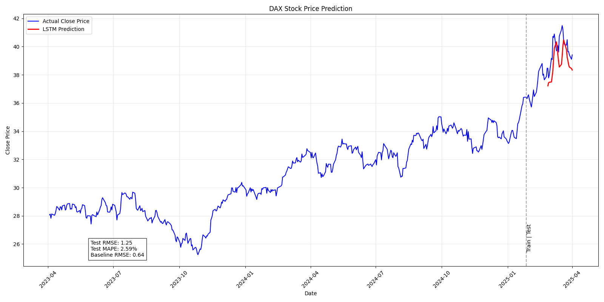
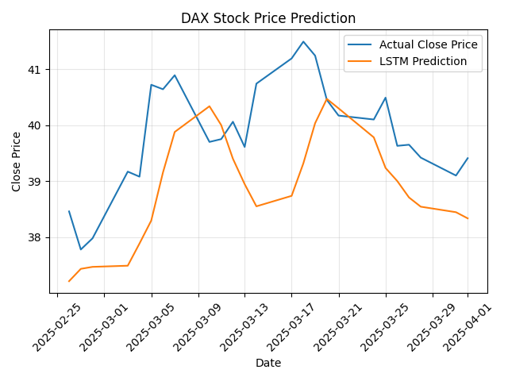
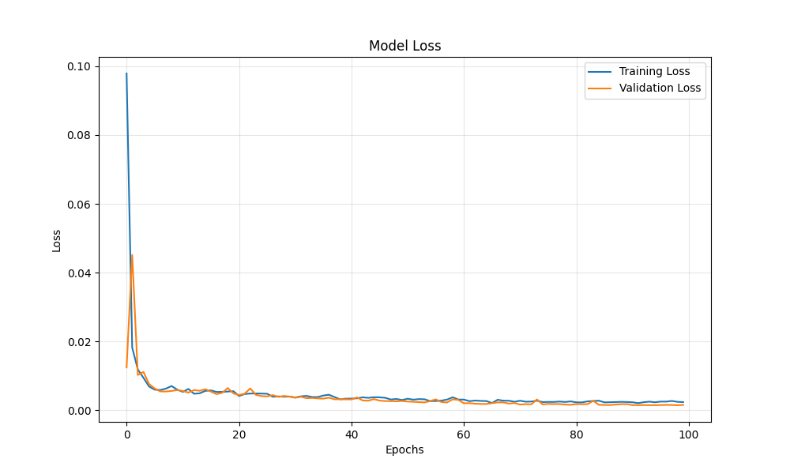

# DAX Stock Price Prediction using LSTM

This project uses an LSTM (Long Short-Term Memory) neural network to predict the closing price of the DAX index based on historical data.

## Data

-   Source: Yahoo Finance (`yfinance` library)
-   Symbol: `DAX`
-   Period: Last 2 years
-   Feature: Closing Price (`Close`)

## Methodology

1.  **Data Fetching:** Fetched 2 years of historical closing prices for the DAX index.
2.  **Train/Test Split:** The last 45 trading days were used as the test set, and the preceding data was used for training.
3.  **Scaling:** Closing prices were scaled to the range [0, 1] using `MinMaxScaler`.
4.  **Sequence Creation:** Input sequences of 20 consecutive closing prices were created to predict the price on the 21st day.
5.  **Model:** A sequential Keras model with two LSTM layers (50 units each) and Dropout (0.2) was built.
6.  **Training:** The model was trained using the Adam optimizer, Mean Squared Error loss, and Early Stopping (monitoring validation loss) to prevent overfitting.
7.  **Evaluation:** Performance was measured using Root Mean Squared Error (RMSE) and Mean Absolute Percentage Error (MAPE). A baseline model (predicting the next day's price as the current day's price) was used for comparison.

## Results

| Metric        | Train | Test  | Baseline |
| :------------ | :---- | :---- | :------- |
| RMSE          | 0.40  | 1.25  | 0.64     |
| MAPE (%)      | 1.03  | 2.59  | 1.20     |

**Interpretation:** The LSTM model performed well on the training data but did not outperform the simple baseline model on the unseen test data. The baseline model had lower RMSE and MAPE on the test set, suggesting the LSTM model, in this configuration, did not capture predictive patterns beyond simply following the previous day's trend for this specific test period.

## Plots

**Prediction vs Actual**

**Prediction vs Actual (Test Set Detail)**

**Model Training History (Loss)**
